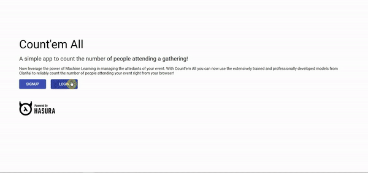

# count-em-all

 

A simple app to count the number of people attending a gathering.

This project was bootstrapped with [Create React App](https://github.com/facebook/create-react-app).

We recommend using [yarn](https://yarnpkg.com/en/) instead of npm.

## Demo

## Setup

Ideal starting point for beginners will be to look at issues labelled as [`good first issue`](https://github.com/sdabhi23/count-em-all/issues?q=is%3Aissue+is%3Aopen+label%3A%22good+first+issue%22).

1. Fork and clone the repo
2. Deploy an instance of Hasura's graphql-engine ([instructions](https://github.com/hasura/graphql-engine/blob/master/README.md#quickstart))
    > Note: If you are a beginner just create an account on Heroku and go ahead with one-click deployment on heroku
3. Secure your graphQl endpoint with an access key
4. Add 2 tables with the following schema from the console of your app
    * ### users
        | id   | name | email |
        | ---  | ---  | ---   |
        | text | text | text  |
        where **id is the primary key**
    * ### event_images
        | id      | name | url   | uploaded_on | user_id | analysis |
        | ---     | ---  | ---   | ---         | ---     | ---      |
        | integer | text | text  | timestamp   | text    | JSON     |
        where **id is the primary key** and user_id is a foreign key.
    * Now go to the schema page by clicking on `Schema - public` on the left hand panel, and click on `Track All Relations`.
5. Get an account on Cloudinary and set an upload preset ([link](https://cloudinary.com/console/settings/upload#upload_presets)) with **mode: unsigned** and **access mode: public**.

## Runs on:

<table>
    <tr>
        <td></td>
        <td></td>
        <td></td>
        <td></td>
    </tr>
</table>

## Maintainers

- Shrey Dabhi ([sdabhi23](https://github.com/sdabhi23))
- Sohel Shaikh ([thesohelshaikh](https://github.com/thesohelshaikh))
